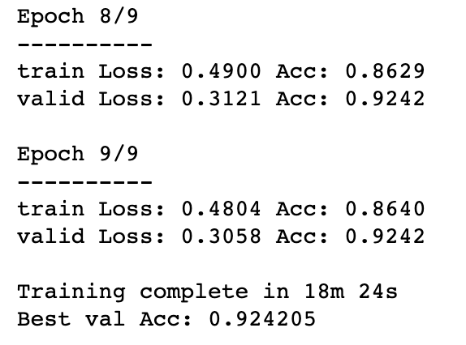
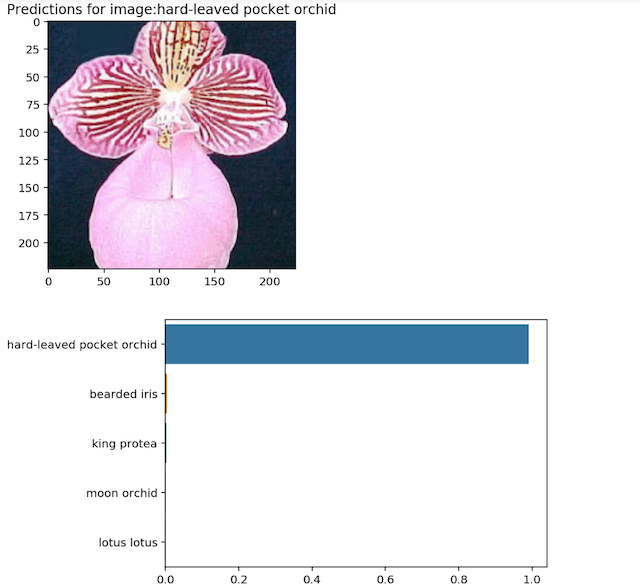
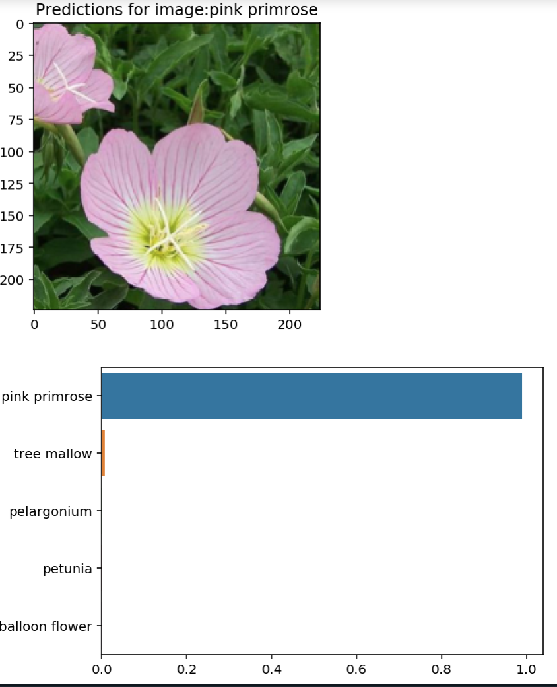

# Udacity Data Science Projects

Projects completed for Udacity Data Science Projects

# Projects

## Flower Classifier 

Train a pytorch resnet 50 model to predict species of flowe (102) classes.

Custom layer   

Training Result

Prediction (Orchid)

Prediction (Primrose)

